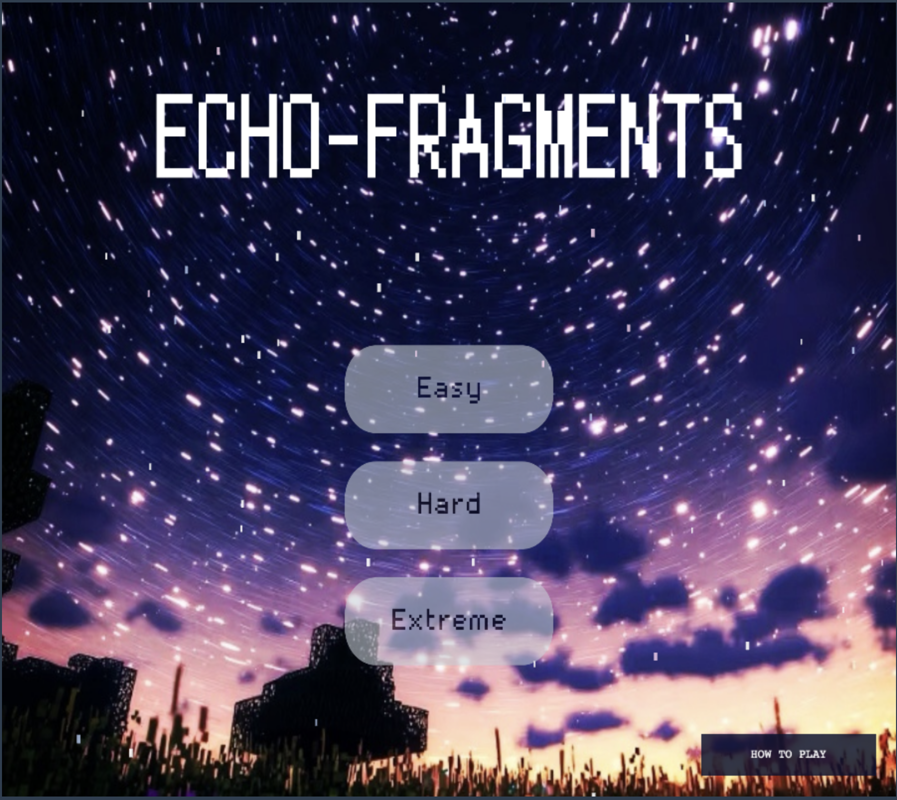
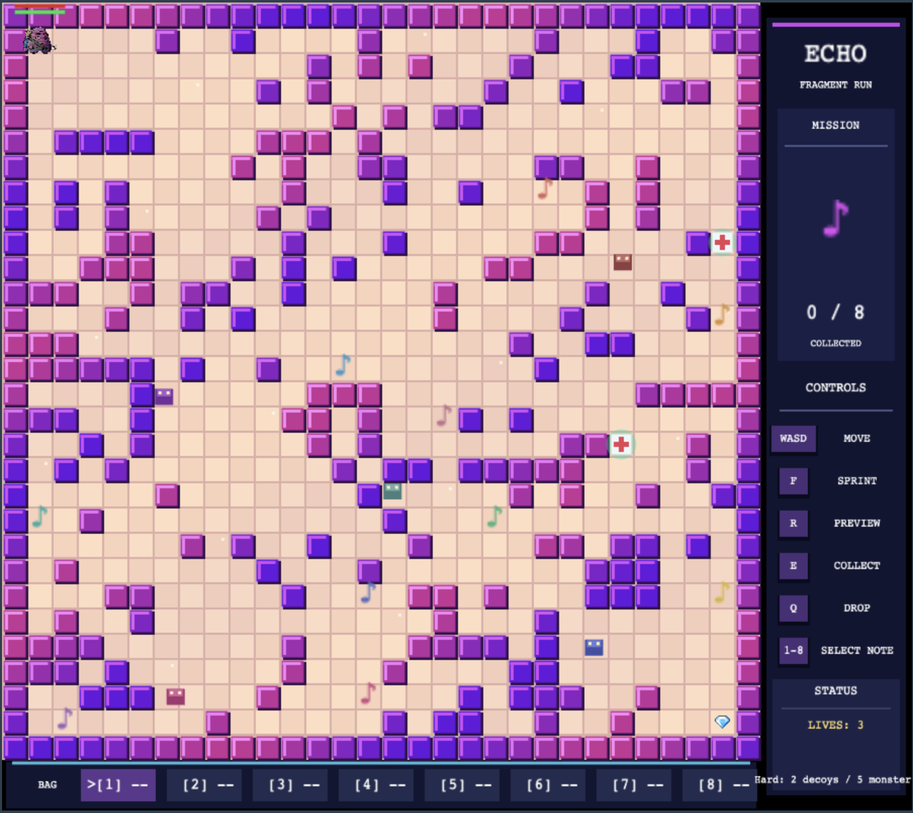
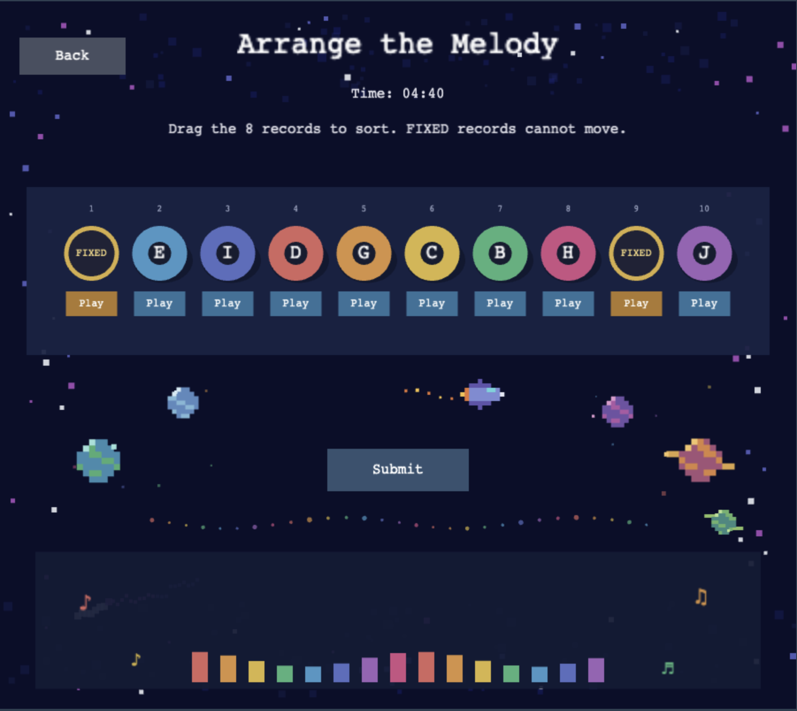
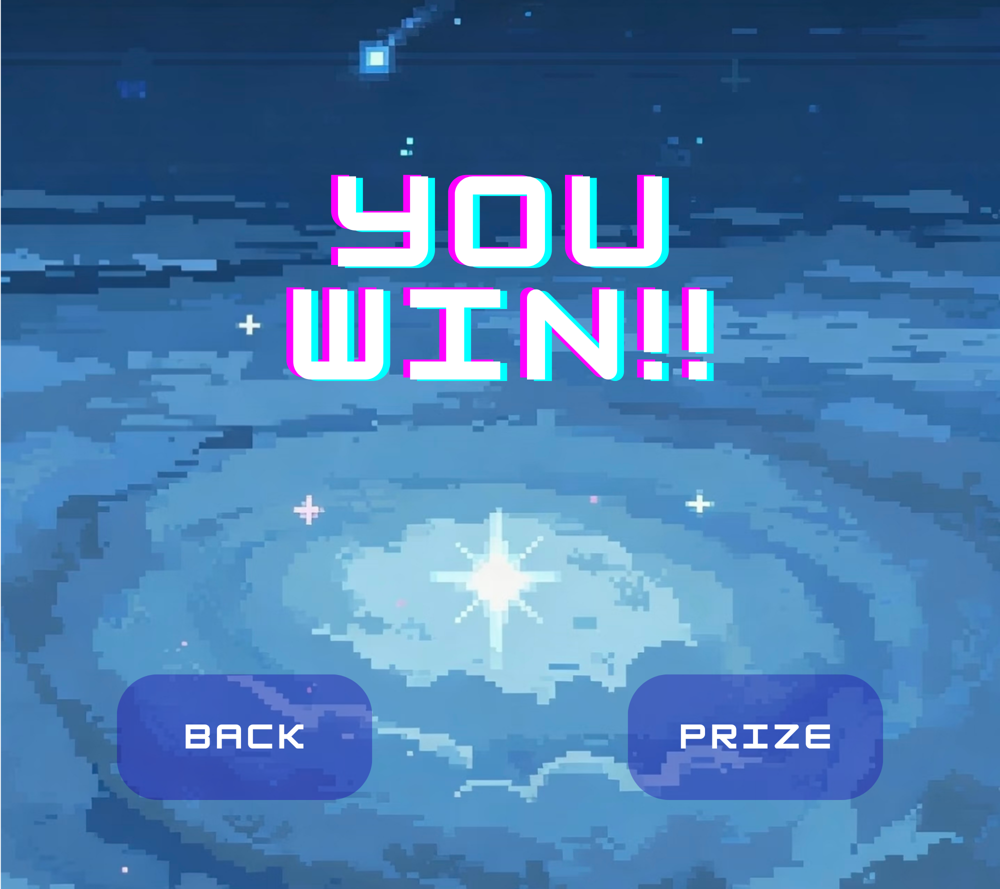
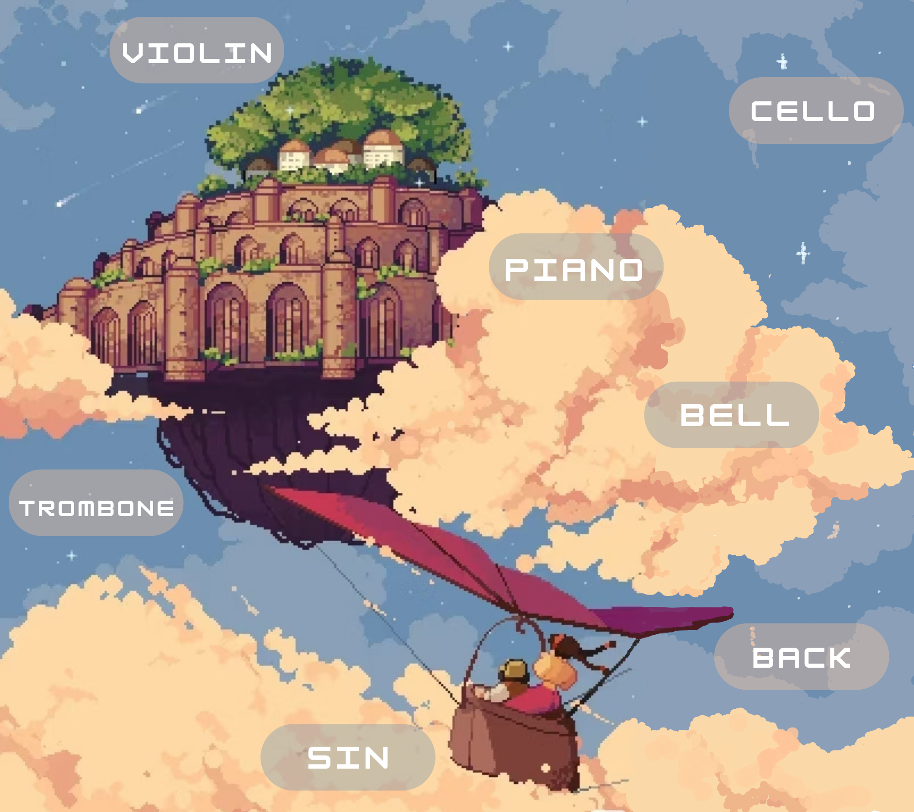
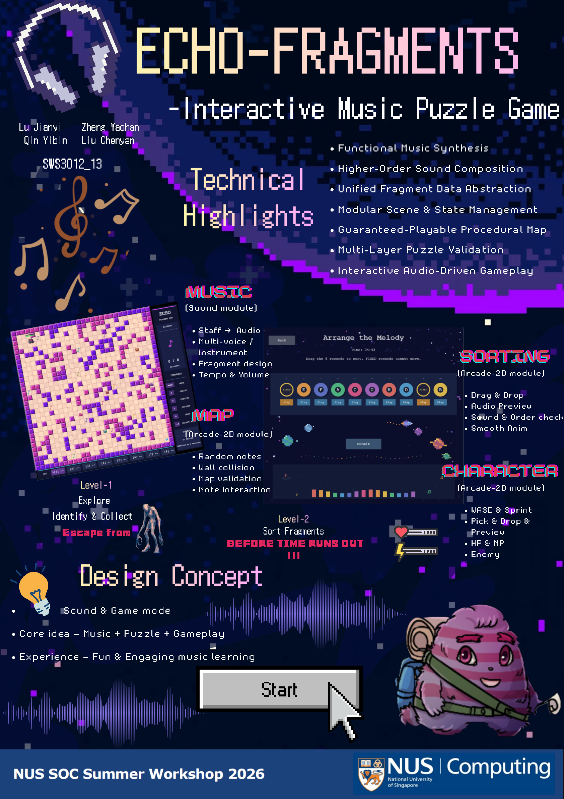

# Echo Fragments

<p align="center">
  <strong>NUS School of Computing Summer Workshop 2026</strong><br>
  <strong>Structure and Interpretation of Computer Programs (SICP) Final Project</strong>
</p>

<p align="center">
  An interactive music puzzle game built with JavaScript and Source Academy.
</p>

<p align="center">
  <strong>Latest Release:</strong>
  <a href="https://github.com/JimmyZheng6/echo-fragments/releases/tag/v1.0.0">
    Echo Fragments v1.0.0
  </a>
</p>

<p align="center">
  
</p>

## About the Project

**Echo Fragments** combines music synthesis, exploration, survival, audio
recognition, and drag-and-drop sequence reconstruction.

A complete melody has been broken into fragments and scattered across a
procedurally generated map. Players first listen to the original song, then
explore the map, preview nearby fragments, collect the correct pieces, and
restore the melody before time runs out.

Visual labels and colours are randomized between games. In harder modes,
distractor fragments are mixed into the map, so players must identify the
correct music by listening instead of memorizing a fixed answer.

## Gameplay Showcase

### 1. Choose a Difficulty and Listen

<table>
  <tr>
    <td width="50%">
      
    </td>
    <td width="50%">
      
    </td>
  </tr>
  <tr>
    <td align="center"><strong>Difficulty Selection</strong></td>
    <td align="center"><strong>Listen to the Complete Song</strong></td>
  </tr>
</table>

### 2. Explore, Preview, and Collect

<p align="center">
  
</p>

Explore a procedurally generated map, avoid monsters, manage health and
stamina, preview nearby music fragments, and collect the eight correct pieces.

### 3. Reconstruct the Melody

<p align="center">
  
</p>

Listen to individual fragments and drag the movable records into their correct
musical order. Fixed records provide reference positions, while distractors
must be recognized and excluded.

### 4. Complete the Game

<table>
  <tr>
    <td width="50%">
      
    </td>
    <td width="50%">
      
    </td>
  </tr>
  <tr>
    <td align="center"><strong>Success</strong></td>
    <td align="center"><strong>Game Over</strong></td>
  </tr>
</table>

<p align="center">
  
</p>

After completing the puzzle, players can enter the prize screen and choose
additional music to play.

## Gameplay Video

Watch or download the complete gameplay demonstration from the
[Echo Fragments v1.0.0 Release](https://github.com/JimmyZheng6/echo-fragments/releases/tag/v1.0.0).

[Download the gameplay video (MP4)](https://github.com/JimmyZheng6/echo-fragments/releases/download/v1.0.0/echo-fragments-gameplay.mp4)

## Gameplay Loop

1. Choose **Easy**, **Hard**, or **Extreme**.
2. Listen carefully to the complete song.
3. Enter the map after the animated countdown.
4. Explore while avoiding monsters and managing health and stamina.
5. Press `R` near a fragment to preview its sound.
6. Press `E` to collect a fragment or enter the sorting stage.
7. Collect all eight correct fragments and reach the goal.
8. Preview, compare, and drag the records into the correct sequence.
9. Submit the sequence to restore the melody.

## Difficulty Levels

| Difficulty | Correct fragments | Distractor fragments |
| --- | ---: | ---: |
| Easy | 8 | 0 |
| Hard | 8 | 2 |
| Extreme | 8 | 4 |

## Controls

| Input | Action |
| --- | --- |
| `W` `A` `S` `D` | Move the character |
| `F` | Sprint while stamina is available |
| `R` | Preview a nearby music fragment |
| `E` | Collect a fragment or enter the sorting stage |
| `Q` | Drop the selected fragment near the character |
| `1`–`8` | Select an inventory slot |
| Mouse | Select menus, play audio, drag records, and submit |

Uppercase and lowercase movement keys are both supported.

## Core Features

### Sound

- Functional music synthesis from note-and-duration lists
- Recursive note-list processing
- Tempo and volume transformations
- Two-hand and multi-instrument sound composition
- Full-song, fragment, distractor, and prize audio

### Map

- Procedural wall and obstacle generation
- Breadth-first-search route validation
- Collision and boundary handling
- Valid fragment, monster, goal, and health-pack placement
- Two health packs refreshed at random valid positions every 30 seconds

### Character

- WASD movement and stamina-based sprinting
- Health, damage, recovery, and a three-life system
- Monster detection, pursuit, and attack behaviour
- Inventory selection and fragment highlighting
- Fragment preview, collection, and safe non-overlapping dropping

### Sorting

- State-driven drag-and-drop interaction
- Slot snapping, swapping, and fixed-fragment protection
- Click-to-play and click-to-stop audio previews
- Countdown timer and submission feedback
- Song identity and musical order validation
- Randomized labels, colours, starting arrangements, and distractors

### Game Flow

- Animated start menu
- Three selectable difficulty levels
- Full-song listening scene with floating music notes
- Large animated `3–2–1` countdown
- Exploration and sorting stages
- Instructions, success, failure, and prize scenes

## Technical Highlights — SICP Concepts in Action

### Functional Music Synthesis

Melodies are encoded as note-and-duration lists. Recursive functions transform
those lists into sine-wave sound functions using the Source Academy `sound`
module.

### Higher-Order Sound Composition

The project uses `map`, lambda expressions, recursion, `make_sound`, and
`get_wave` to process musical data. `consecutively` builds melodic lines, while
`simultaneously` combines right-hand, left-hand, and multi-instrument parts.

### Unified Fragment Data Abstraction

Every music fragment follows one shared interface:

```text
[fragment_id, song_id, audio_url]
```

The map, inventory, preview system, difficulty system, and sorting puzzle all
consume the same representation.

### Modular Scene and State Management

A shared update loop coordinates the menu, listening, exploration, sorting,
success, failure, and prize scenes. Explicit state variables manage input
edges, audio playback, timers, dragging, inventory, health, stamina, monsters,
and scene transitions.

### Guaranteed-Playable Procedural Map

Walls and objects are generated algorithmically. Breadth-first search uses a
queue and visited grid to verify that the player can reach the goal, preventing
unwinnable maps.

### Identity-Based Sequence Validation

The label displayed on a record is separated from its real musical identity.
Dragging changes only the record's slot, while its `fragment_id`, `song_id`,
and audio remain attached. Submission reconstructs the sequence by slot and
validates the real identities rather than the randomized labels.

### Interactive Audio-Driven Gameplay

Sound is part of the game logic rather than decoration. Players preview
fragments on the map, compare recordings in the sorting stage, and solve the
puzzle by listening.

## Fragment and Sorting Data

A map fragment stores its persistent musical identity:

```text
[fragment_id, song_id, audio_url]
```

A sorting record conceptually contains three layers:

| Layer | Stored data | Purpose |
| --- | --- | --- |
| Display | label, colour, shape | What the player sees |
| Sorting | slot | Where the record currently is |
| Identity | fragment ID, song ID, audio | What the record really represents |

This separation allows the game to randomize labels and colours without
changing the real answer.

## Project Structure

```text
echo-fragments/
├── MAP/                         # Map development and earlier stages
├── assets/                      # Runtime backgrounds and ending artwork
│   ├── failure.jpg
│   ├── listening-background.png
│   ├── prize.jpg
│   ├── start-menu-background.png
│   └── success.png
├── character/                   # Character-system development
├── docs/
│   ├── echo-fragments-poster.pdf
│   ├── echo-fragments-poster_Page.png
│   └── screenshots/
│       ├── failure.jpg
│       ├── listening-screen.png
│       ├── map-gameplay.png
│       ├── prize.png
│       ├── sorting-gameplay.png
│       ├── start-menu.png
│       └── success.png
├── sorting/
│   └── sorting.js               # Sorting-stage development
├── sound/
│   ├── music_mp3/               # Full song, fragments, and prize audio
│   └── ...                       # Sound synthesis source files
├── echo-fragments-game.js        # Complete integrated game
├── README.md
└── LICENSE
```

## How to Run the Game

Echo Fragments is designed to run inside the
[Source Academy Playground](https://sourceacademy.org/playground). It is not a
standalone desktop application, so do not run `echo-fragments-game.js` by
double-clicking it or by opening it directly in a browser.

### Option 1 — Run Directly from GitHub

1. Open [`echo-fragments-game.js`](echo-fragments-game.js) in this repository.
2. Click **Raw**, or open the file and copy all of its source code.
3. Open the [Source Academy Playground](https://sourceacademy.org/playground).
4. Select **JavaScript** as the language.
5. Select **full JavaScript** as the execution variant.
6. Delete any existing code in the editor and paste the complete contents of
   `echo-fragments-game.js`.
7. Click **Run**.
8. Open the **Arcade 2D** game display if it is not shown automatically.
9. Click **Easy**, **Hard**, or **Extreme** to begin.

### Option 2 — Run from the Downloaded Release

1. Open the
   [Echo Fragments v1.0.0 Release](https://github.com/JimmyZheng6/echo-fragments/releases/tag/v1.0.0).
2. Under **Assets**, download **Source code (zip)**.
3. Unzip the downloaded file.
4. Open `echo-fragments-game.js` with a text editor or code editor.
5. Copy the entire file.
6. Open the [Source Academy Playground](https://sourceacademy.org/playground).
7. Select **JavaScript** and **full JavaScript**.
8. Paste the code, click **Run**, and open the **Arcade 2D** display.

### Important Notes

- Keep the `import` statement at the beginning of the file.
- Keep `build_game()` as the final statement in the program.
- The game loads its images and audio from this GitHub repository, so an
  internet connection is required.
- No separate installation, `npm` command, or local web server is needed.
- If the music does not start immediately, click inside the game display and
  press the relevant **Play** button again.
- If an asset fails to load, confirm that GitHub is accessible, then run the
  program again.

## Project Poster

<p align="center">
  <a href="docs/echo-fragments-poster.pdf">
    
  </a>
</p>

<p align="center">
  <a href="docs/echo-fragments-poster.pdf">View or download the full project poster (PDF)</a>
</p>

## Team Contributions

| Team member | Main responsibility | Contribution |
| --- | --- | --- |
| [**Lu Jianyi**](https://github.com/jianyilu13-art) | Sound | Music synthesis, note and duration data, sound composition, fragment generation, and audio resources |
| [**Zheng Yaohan**](https://github.com/JimmyZheng6) | Sorting | Sorting interface, record dragging, audio previews, timers, identity-based validation, and sorting UI |
| [**Qin Yibin**](https://github.com/qinf9263-design) | Character | Movement, sprint and stamina, health and lives, inventory, collection, dropping, and character interaction |
| [**Liu Chenyan**](https://github.com/Prof-Liu6) | Map | Procedural map construction, walls, collision, fragment placement, path validation, and map interaction |

## Technology

- JavaScript
- Source Academy
- SICP JS
- Source Academy `arcade_2d` module
- Source Academy `sound` module
- Functional programming, recursion, lists, higher-order functions, and state

## Course Information

**NUS School of Computing**  
**Summer Workshop 2026**  
**Structure and Interpretation of Computer Programs (SICP)**

## License

This project is released under the [MIT License](LICENSE) and was developed for
educational purposes as the final project of the NUS School of Computing Summer
Workshop 2026.
